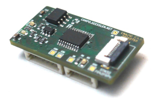

# TDTDump

TDT is an CAN based protocol for simple sensor values.

This tool dumps traffic from a CAN bus and prints the human readable 
interpretation of the TDT messages.

This repository uses 'libtdt' and 'canhub' as git submodules.

# Compile TDTDump

## Checkout the sources

<pre style="background-color: black; color: white;">
git clone https://github.com/maxses/tdtdump.git
cd tdtdump
git submodule init
git submodule update
</pre>

## Compile sources

<pre style="background-color: black; color: white;">
mkdir build
cd build
cmake ..
make -j$(nproc)
</pre>

# Test via virtual CAN interface

To test the binary without actual CAN interface or TDT traffic, the virtual CAN
device can be used:
<pre style="background-color: black; color: white;">
sudo modprobe vcan
sudo ip link add dev vcan0 type vcan
sudo ip link set vcan0 mtu 16
sudo ip link set up vcan0
</pre>

## Run the binary

Two terminals are needed for this test. One runs the binary, the other one is
needed to send the message.
<pre style="background-color: black; color: white;">
./tdtdump -i vcan0
</pre>

## Send an TDT message

TO send an canmessage from terminal, the software package 'can-utils' need to 
be installed.
<pre style="background-color: black; color: white;">
sudo apt install can-utils
</pre>

<pre style="background-color: black; color: white;">
cansend vcan0 419#18.04.04.00.90.0C.00.00
</pre>

tdtdump should now print something like:
<pre style="background-color: black; color: white;">
Id: 0x419; Size: 8; Data:  18 04 04 00 90 0C 00 00
         Node ID: 0x19
         Function code: sendObject [0x8]
         Object: Temperature[0] [0x418]
         Unit: centiCelsius [0x4]
         Value: 32.16 °C [0xC90]
</pre>
